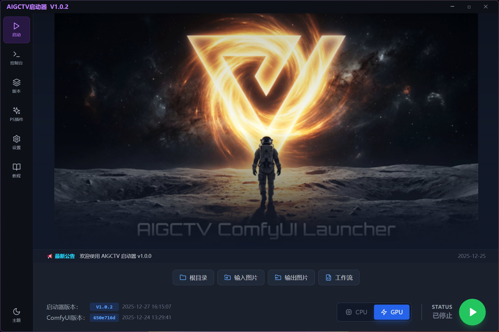
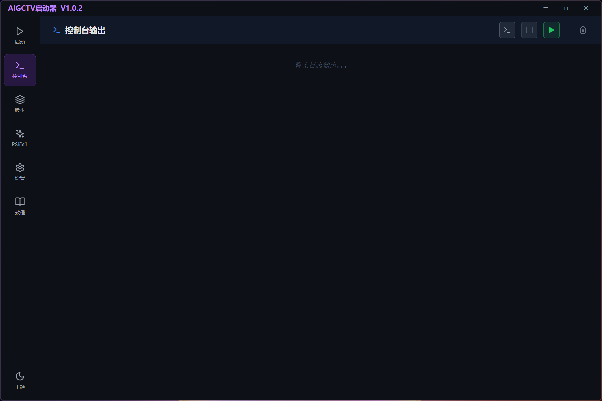
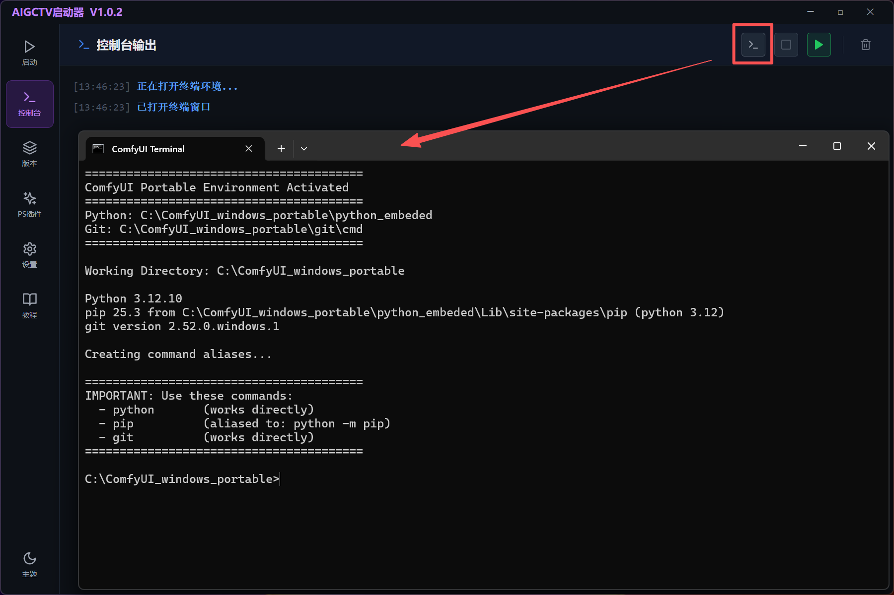
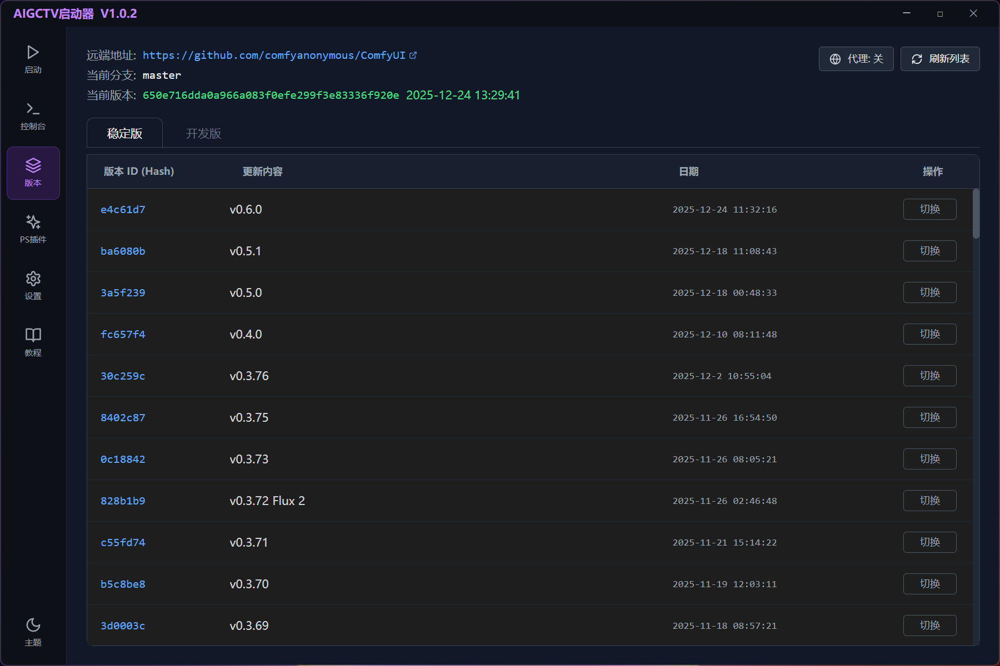
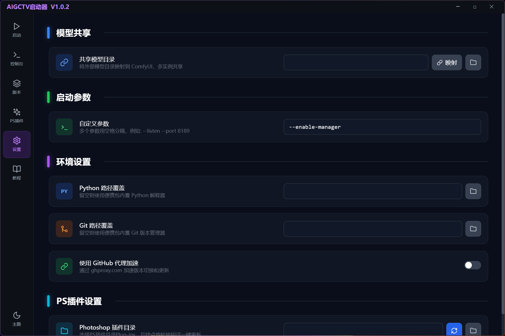
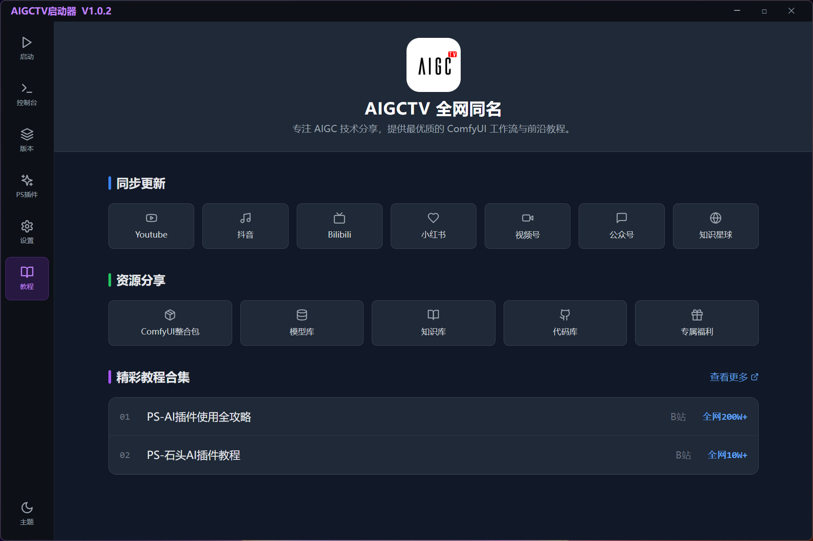

# V ComfyUI Launcher User Manual

[English](UserGuide.md) | [中文](UserGuide_CN.md)

This manual follows the order of the sidebar in the launcher, providing a detailed introduction to the functions and operations of each page.

## Table of Contents

1.  [▶️ Dashboard](#1-dashboard)
2.  [🖥️ Console](#2-console)
3.  [📚 Versions](#3-versions)
4.  [✨ PS Plugins](#4-ps-plugins)
5.  [⚙️ Settings](#5-settings)
6.  [📖 Tutorials](#6-tutorials)
7.  [🌓 Themes](#7-themes)

---

## 1. ▶️ Dashboard
The homepage of the launcher, used for daily basic operations.

### Core Features
*   **Status Monitoring**: Displays the current status (`Stopped`, `Starting`, `Running`) in the bottom right corner.
*   **Mode Switching**:
    *   **CPU**: Uses only CPU for computation, suitable for environments without a dedicated GPU (slower).
    *   **GPU**: Uses NVIDIA GPU acceleration, recommended mode.
*   **One-Click Start/Stop**: Click the large play button in the bottom right corner to start ComfyUI.
*   **Quick Directories**:
    *   `Root`: Opens the ComfyUI installation root directory.
    *   `Input`: Opens the `ComfyUI/input` folder for placing images directly.
    *   `Output`: Opens the `ComfyUI/output` folder to view generation results.
    *   `Workflows`: Opens the user workflows directory.

### Operation Demo
1.  Ensure the mode is set to **GPU** (if you have an NVIDIA card).
2.  Click the green **Play Button**.
3.  The status changes to "Starting", then "Running", and the browser will automatically open the ComfyUI interface.

> 

---

## 2. 🖥️ Console
A place to view background logs, used for troubleshooting and advanced operations.

### Core Features
*   **Log Output**: Real-time display of Python console output from the ComfyUI backend. Any generation errors or missing nodes will be shown here (in red text).
*   **Open Terminal**: Click the "Open Terminal" button at the top to open an independent CMD window. This window is pre-configured with Python and Git environment variables, allowing you to directly run commands like `pip install package_name` to install missing dependencies.
*   **Clear Logs**: Clears the current screen display.

> 
> 

---

## 3. 📚 Versions
Manage ComfyUI kernel versions, supporting updates and rollbacks.

### Core Features
*   **Branch Switching**: Toggle between `Stable` and `Dev` (Development) branches via the top tabs.
*   **Version List**: Displays the entire Git commit history, including update messages and dates.
*   **Current Version**: The list highlights the currently active version (green background).
*   **Switch Version**: Click the **"Switch"** button next to any historical version, and the launcher will automatically execute Git commands to rollback or update the kernel to that state.
*   **GitHub Proxy**: Top toggle switch. If you experience slow downloads in mainland China, please **enable** the proxy to use a mirror source for acceleration.

### Operation Demo
1.  Go to the "Versions" page.
2.  Enable "GitHub Proxy".
3.  Click "Refresh List" to get the latest updates.
4.  Find the latest version at the top of the list and click "Switch".
5.  Wait for the "Version switch successful" prompt.

> 
> 

---

## 4. ✨ PS Plugins
A feature designed for Photoshop workflow users, converting any RunningHub AI application (image) into a PS plugin with one click.

### Core Features
*   **RunningHub Integration**:
    *   **API Key**: Enter your RunningHub key.
    *   **Workflow ID**: Enter the Workflow ID from RunningHub.
    *   **Generate Workflow**: Click the button to automatically convert the online workflow into a local ComfyUI-compatible JSON file.
*   **Task Monitoring**: Automatically tracks cloud task status, displaying queue and running progress.
*   **Account Info**: Displays your RH Coin balance.

### Operation Demo
1.  Enter API Key and Workflow ID.
2.  Click "Generate Workflow".
3.  Wait for the success prompt; the generated `.json` file will be saved to the default workflow directory.
4.  Copy the file path or click "Open Folder" to view.

> 
> 

---

## 5. ⚙️ Settings
Global configuration and environment management.

### Core Features
*   **Model Symlink**:
    *   **Scenario**: If you have multiple ComfyUI packages and don't want to redownload gigabytes of models.
    *   **Action**: Enter the path of your shared model folder in the "Shared Model Directory" box and click "Link". The launcher will create a symbolic link, allowing the current ComfyUI to read the shared models directly.
*   **Launch Arguments**:
    *   Enter custom commands, such as `--enable-manager` (enable manager), `--port 8888` (change port), `--preview-method auto` (preview mode).
*   **Environment Override**:
    *   If you prefer not to use the portable package's built-in environment, you can specify the paths to your local `Python.exe` and `Git.exe` here.
*   **PS Plugin Path**:
    *   Set the Photoshop plugin installation directory, supporting one-click updates for plugin files.

> 

---

## 6. 📖 Tutorials
One-click access to AIGCTV video tutorials, resource sharing, and best-of collections.

*   Includes FAQs, shortcut keys explanations, and relevant tutorial links.

> 

---

## 7. 🌓 Themes
Supports Dark and Light mode switching to meet requirements for different creative environments.

### Core Features
*   **Dark Mode**: Default recommended mode, reduces eye strain, immersive creation.
*   **Light Mode**: Suitable for bright environments, UI is more clean.
*   **Switching Method**: Click the "Theme Button" in the bottom left corner to switch between dark and light modes with one click.

> 

