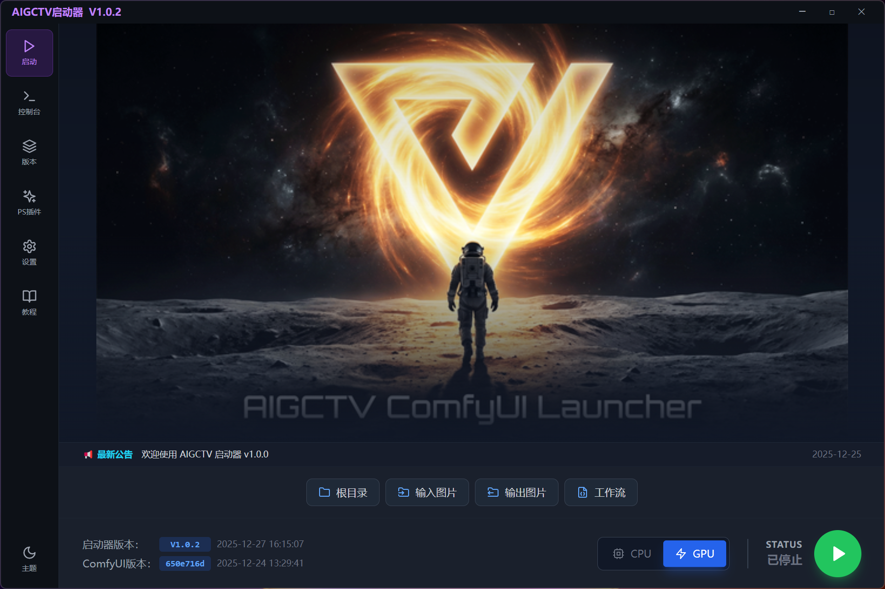
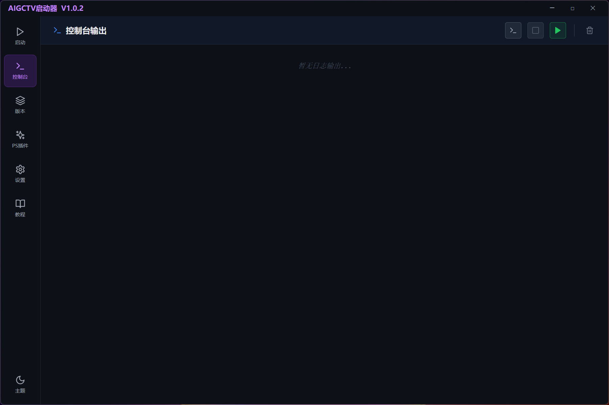
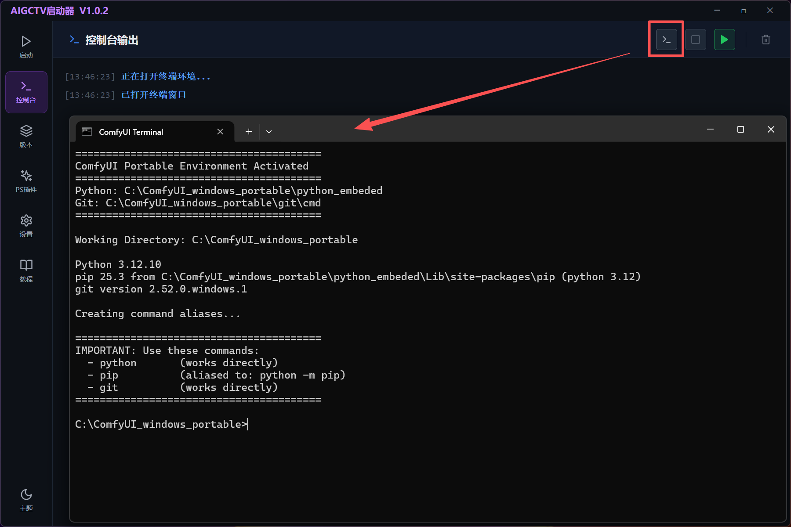
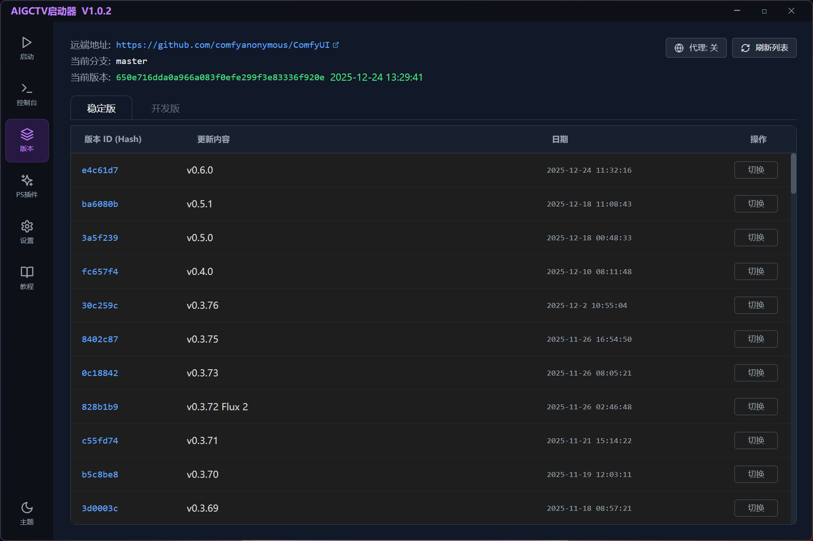
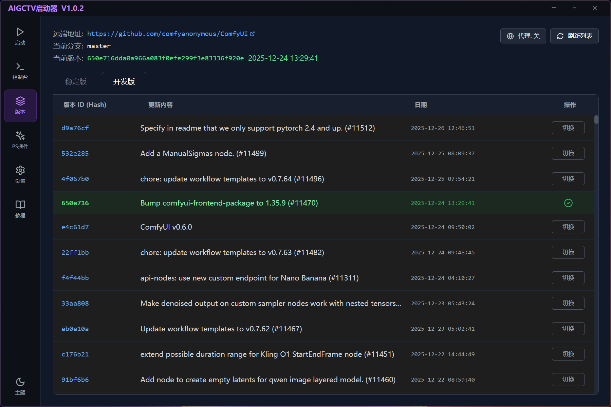
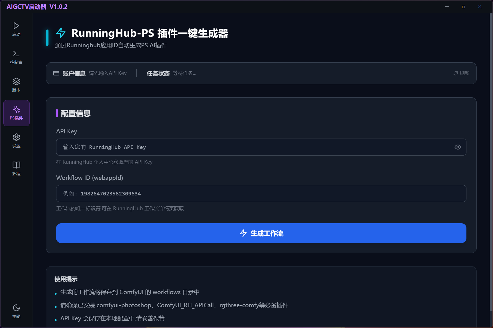
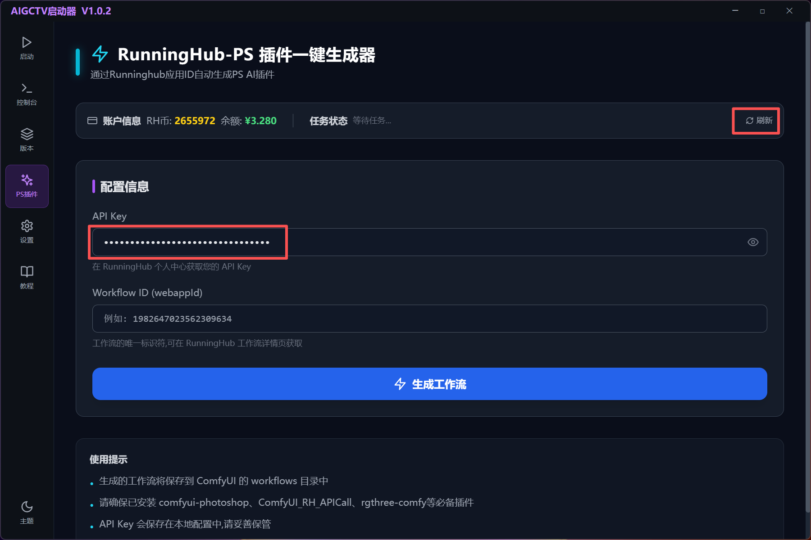
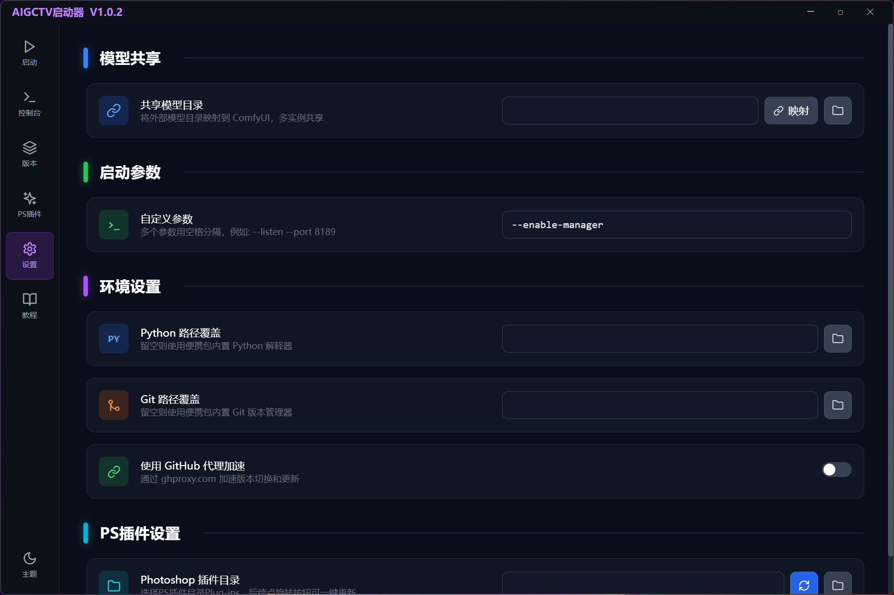
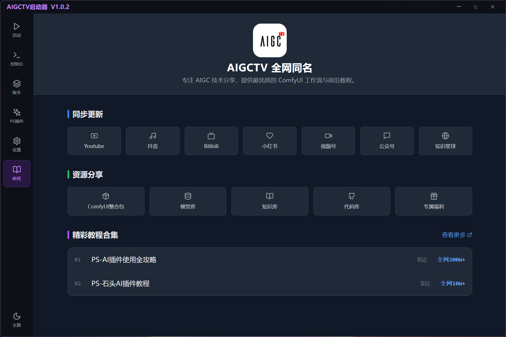
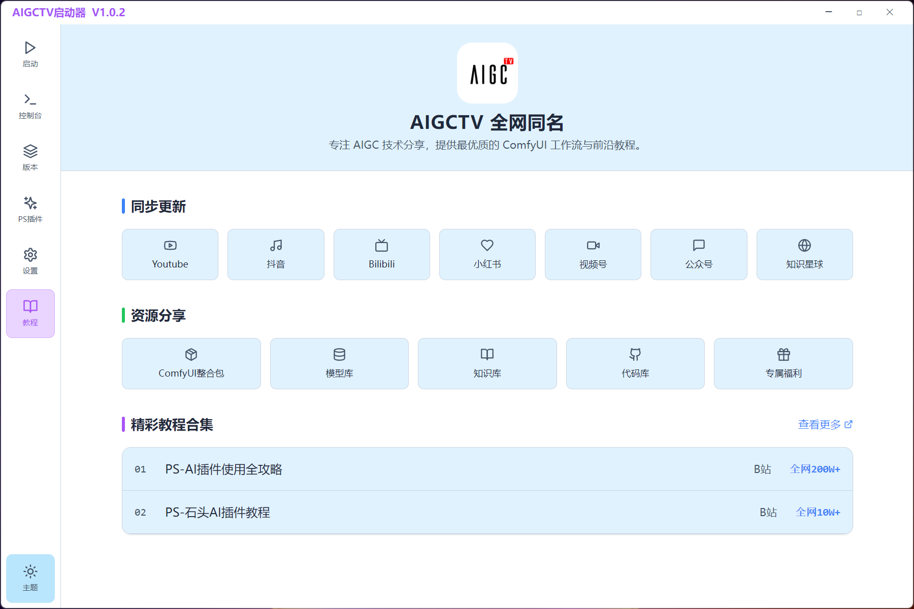

# ComfyUI Launcher 使用手册

[English](UserGuide.md) | [中文](UserGuide_CN.md)

本手册严格按照启动器左侧侧边栏的顺序，详细介绍每个页面的功能与操作步骤。

## 目录

1.  [▶️ 启动 (Dashboard)](#1-启动-dashboard)
2.  [🖥️ 控制台 (Console)](#2-控制台-console)
3.  [📚 版本 (Versions)](#3-版本-versions)
4.  [✨ PS插件 (PS Plugins)](#4-ps插件-ps-plugins)
5.  [⚙️ 设置 (Settings)](#5-设置-settings)
6.  [📖 教程 (Tutorials)](#6-教程-tutorials)
7.  [🌓 主题切换 (Themes)](#7-主题切换-themes)

---

## 1. ▶️ 启动 (Dashboard)
启动器的主页，用于日常最基础的操作。

### 核心功能
*   **运行状态监控**: 页面右下角显示当前状态（`已停止`、`启动中`、`运行中`）。
*   **模式切换**:
    *   **CPU**: 仅使用 CPU 运算，适合无独立显卡的情况（速度较慢）。
    *   **GPU**: 使用 NVIDIA 显卡加速，默认推荐模式。
*   **一键启动/停止**: 点击右下角的大号播放按钮即可启动 ComfyUI。
*   **快捷目录**:
    *   `根目录`: 打开 ComfyUI 安装根目录。
    *   `输入图片`: 打开 `ComfyUI/input` 文件夹，放入需要处理的图片。
    *   `输出图片`: 打开 `ComfyUI/output` 文件夹，查看生成结果。
    *   `工作流`: 打开用户工作流存放目录。

### 操作示范
1.  确认右下角模式选择为 **GPU** (如果有 N 卡)。
2.  点击绿色的 **播放按钮**。
3.  状态变为"启动中"，随后变为"运行中"，浏览器会自动打开 ComfyUI 界面。

> 

---

## 2. 🖥️ 控制台 (Console)
查看程序后台运行日志的地方，用于排错和高级操作。

### 核心功能
*   **日志输出**: 实时显示 ComfyUI 后端的 Python 控制台输出。如果生成报错、缺节点，错误信息会在这里显示（红色字体）。
*   **打开终端**: 点击顶部的"打开终端环境"按钮，会弹出一个独立的 CMD 窗口。该窗口已自动配置好 Python 和 Git 环境变量，您可以直接在里面输入 `pip install package_name` 来手动安装缺失的依赖库。
*   **清空日志**: 清除当前的屏幕显示。

> 
> 

---

## 3. 📚 版本 (Versions)
管理 ComfyUI 内核版本，支持更新和回退。

### 核心功能
*   **分支切换**: 顶部标签栏可切换 `稳定版 (Stable)` 和 `开发版 (Dev)`。
*   **版本列表**: 显示所有的 Git 提交历史，包含更新内容和日期。
*   **当前版本**: 列表会自动高亮当前正在使用的版本（绿色背景）。
*   **切换版本**: 点击任意历史版本右侧的 **"切换"** 按钮，启动器会自动执行 Git 命令将内核回退或更新到该状态。
*   **GitHub 代理**: 顶部开关。如果在中国大陆地区下载慢，请**开启**代理，使用镜像源加速。

### 操作示范
1.  进入"版本"页面。
2.  开启"GitHub 代理"。
3.  点击"刷新列表"获取最新更新。
4.  找到列表顶部的最新版本，点击"切换"。
5.  等待提示"版本切换成功"。

> 
> 

---

## 4. ✨ PS插件 (PS Plugins)
专为 Photoshop 工作流用户设计的功能，可以把RunningHub任意AI应用（图像）一键转换成PS插件，直接在Photoshop中调用。

### 核心功能
*   **RunningHub 集成**:
    *   **API Key**: 输入 RunningHub 的密钥。
    *   **Workflow ID**: 输入 RunningHub 上的工作流 ID。
    *   **生成工作流**: 点击按钮，自动将在线工作流转换为本地 ComfyUI 兼容的 JSON 文件。
*   **任务监控**: 自动追踪云端任务状态，显示排队、运行进度。
*   **账户信息**: 显示 RH 币余额。

### 操作示范
1.  填入 API Key 和 Workflow ID。
2.  点击"生成工作流"。
3.  等待提示成功，生成的 `.json` 文件会自动保存到默认工作流目录。
4.  复制文件路径或直接点击"打开文件夹"查看。

> 
> 

---

## 5. ⚙️ 设置 (Settings)
全局配置与环境管理。

### 核心功能
*   **模型共享 (Model Symlink)**:
    *   **场景**: 如果你有多个 ComfyUI 整合包，不想重复下载几个 G 的大模型。
    *   **操作**: 在"共享模型目录"输入框填入公共模型文件夹路径，点击"映射"。启动器会创建软链接，让当前 ComfyUI 直接读取公共模型。
*   **启动参数**:
    *   输入自定义命令，如 `--enable-manager` (启用节点管理器)、 `--port 8888` (修改端口)、`--preview-method auto` (预览模式)。
*   **环境覆盖**:
    *   如果你不想使用便携包自带的环境，可以在这里指定本机安装的 `Python.exe` 和 `Git.exe` 路径。
*   **PS 插件路径**:
    *   设置 Photoshop 插件安装目录，支持一键更新插件文件。

> 

---

## 6. 📖 教程 (Tutorials)
内置AIGCTV的视频教程、资源分享、精彩合集等，一键直达。

*   包含常见问题解答、快捷键说明及相关教程链接。

> 

---

## 7. 🌓 主题切换 (Themes)
支持深色 (Dark) 与浅色 (Light) 模式切换，满足不同创作环境的需求。

### 核心功能
*   **深色模式**: 默认推荐模式，减少眼部疲劳，沉浸式创作。
*   **浅色模式**: 适合明亮环境，UI 更加清新。
*   **切换方式**: 点击页面左下角的"主题按钮"即可在黑白模式间一键切换。

> 
